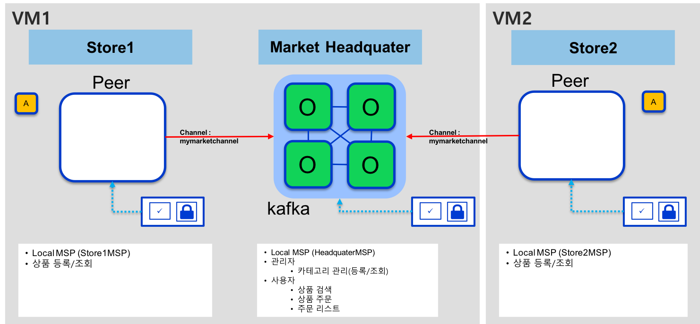
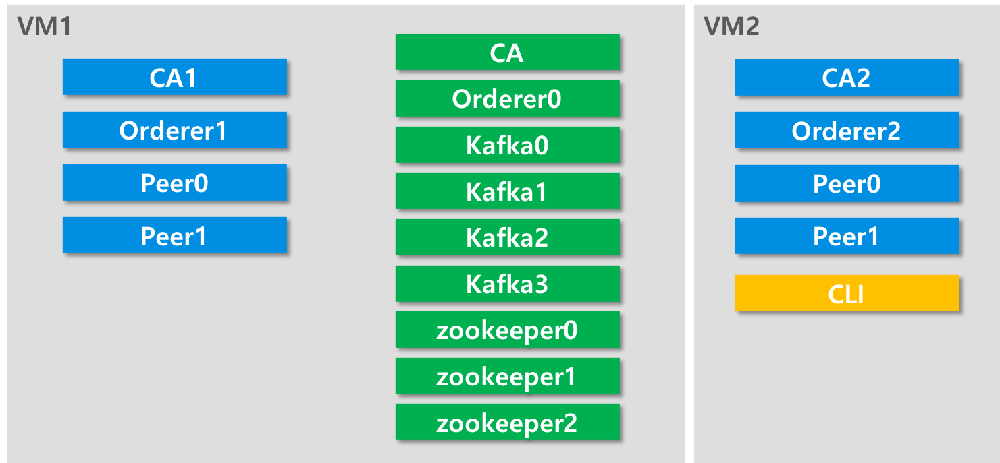

## Hyperledger Fabric을 이용한 상품 거래 시스템 개발

> 개발환경은 우분투 16.04 기반으로 테스트하여 작성하였습니다.

도메인 정보
* Headquater
   * mymarket.com
* Store1
   * store1.mymarket.com
* Store2
   * store2.mymarket.com
   
Ordering Service
* OrdererType : kafka
* Orderer
   * orderer0.mymarket.com
   * orderer1.mymarket.com
   * orderer2.mymarket.com
* kafka broker
   * kafka0
   * kafka1
   * kafka2
   * kafka3



아래 그림은 mymarket 실행을 위한 컨테이너 리스트 입니다.


### 사전 개발 환경 준비
* Docker
    * 17.06.2-ce 이상
* Docker-compose
    * 1.14.0 이상 버전
* Golang
    * 1.10.x 버전 이상
* Nodejs
    * 8.x 버전
* NPM
    * 5.6
* 우분투
    * g++ 설치
    <pre><code>apt install g++</code></pre>


### VM 네트워크 설정
이 항목은 Fabric Network를 멀티노드로 구성하기 위해서 필요합니다.(현재는 Docker swarm으로 설명하고 있으며, 다른 방법으로 멀티 노드 구성은 업데이트 예정)
단일 노드로 구성 할 경우 네트워크 설정 항목은 skip 합니다.

#### Docker swarm 네트워크 설정

* VM1

VM1에서 다음의 명령을 실행

<pre><code>docker swarm init</pre></code>

<pre><code>docker swarm join-token manager</pre></code>
위의 명령을 실행하면 아래와 같은 메시지를 확인 할 수 있으며 VM2에서 명령을 실행합니다.
<pre><code>docker swarm join --token SWMTKN-1-3uhjzu2hfh9x3yhwzleh326wud22yaee65kqb88pczx4m0uwij-40ksc4c7pnmj9b3okxdmc9wqp 10.142.0.3:2377</pre></code>

다음의 명령을 통해서 도커 네트워크를 생성합니다.
<pre><code>docker network create --attachable --driver overlay my-net</code></pre>


github repository를 clone 합니다.

<pre><code>
git clone https://github.com/mjkong/mymarket
cd mymarket
</code></pre>

### Fabric 네트워크를 위한 아티팩트 생성

인증서 생성
<pre><code>cryptogen generate --config=./crypto-config.yaml</code></pre>

아티팩트 생성
<pre><code>
mkdir channel-artifacts
export FABRIC_CFG_PATH=$PWD
export CHANNEL_NAME=mymarketchannel
configtxgen -profile TwoOrgsOrdererGenesis -outputBlock ./channel-artifacts/genesis.block
configtxgen -profile TwoOrgsChannel -outputCreateChannelTx ./channel-artifacts/channel.tx -channelID $CHANNEL_NAME
configtxgen -profile TwoOrgsChannel -outputAnchorPeersUpdate ./channel-artifacts/Store1MSPanchors.tx -channelID $CHANNEL_NAME -asOrg Store1MSP
configtxgen -profile TwoOrgsChannel -outputAnchorPeersUpdate ./channel-artifacts/Store2MSPanchors.tx -channelID $CHANNEL_NAME -asOrg Store2MSP
</pre></code>

새로 생성된 인증서에서 CA Key파일의 정보를 YAML 파일에서 수정합니다.

* ca.store1.mymarket.com 를 위한 인증서 위치
<pre><code>
~/mymarket/crypto-config/peerOrganizations/store1.mymarket.com/ca$ ls
66c2bea4ef42056d1f1807c978c8ec783e403557e1311c8beb1118244092ac4f_sk  ca.store1.mymarket.com-cert.pem
~/mymarket/crypto-config/peerOrganizations/store1.mymarket.com/ca$
</pre></code>

Key 파일명(66c2bea4ef42056d1f1807c978c8ec783e403557e1311c8beb1118244092ac4f_sk)을 node1.yaml의 다음 위치에 적용합니다.
<pre><code>
  ca.store1.mymarket.com:
    image: hyperledger/fabric-ca
    environment:
      - CORE_VM_DOCKER_HOSTCONFIG_NETWORKMODE=my-net
      - FABRIC_CA_HOME=/etc/hyperledger/fabric-ca-server
      - FABRIC_CA_SERVER_CA_NAME=ca.store1.mymarket.com
      - FABRIC_CA_SERVER_CA_CERTFILE=/etc/hyperledger/fabric-ca-server-config/ca.store1.mymarket.com-cert.pem
      - FABRIC_CA_SERVER_CA_KEYFILE=/etc/hyperledger/fabric-ca-server-config/**66c2bea4ef42056d1f1807c978c8ec783e403557e1311c8beb1118244092ac4f_sk**
    ports:
      - "17054:7054"
</pre></code>

위와 같이 ```ca.mymarket.com```, node2.yaml에서 ```ca2.store2.mymarket.com``` 도 수정합니다.

### Fabric 네트워크 실행
mymarket 프로젝트 디렉토리를 압축하여 VM2로 복사합니다.
<pre><code>
cd ../
tar -cvf mymarket.tar mymarket
</pre></code>

각 VM에서 도커 컨테이너를 실행합니다.

* VM1

mymarket 디렉토리로 이동합니다.
<pre><code>
docker-compose -f node1.yaml up -d
</pre><code>


* VM2

<pre><code>
docker-compose -f node2.yaml up -d
</pre></code>


